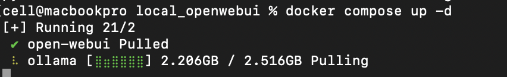
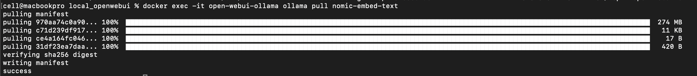

# Building Ollama with OpenWebUI Using OpenAI API Key on Localhost

In this guide, you will learn how to set up and deploy Ollama with OpenWebUI on your local machine using your OpenAI API key. A future post will cover deployment on a VPS or a real web hosting server.

## Steps

**1. Set Up OpenAI API Key**

Begin by setting up your OpenAI API key. Make sure you have it ready for the next steps.


**2. Build and Deploy Docker Containers**

Use Docker Compose to build and run the required containers in detached mode.

```batch
docker compose up -d
```




**3 Confirm Containers are Working**

Verify that the containers are running correctly.


**4 Retrieve Embedding Model for Ollama**

Retrieve the embedding model for Ollama from within the "open-webui-ollama" container. Note that "open-webui-ollama" is the name specified for the Ollama container.

```batch
docker exec -it open-webui-ollama ollama pull nomic-embed-text
```




**5 Test the OpenWebUI Localhost Website**

Open a browser and navigate to http://localhost:3000. The first user to sign up will have admin privileges by default.
First user is admin as default.


Sign up using a username, email, and password.


**6 Set Up Models**

After signing up, you'll be directed to the main homepage, displaying all available models. Admin users can configure these models via the admin panel.


**7 (Optional) Update Image Version or Shutdown Localhost Web**

To update your Docker images or shut down the containers, run:

```batch
docker compose down
```

```batch
docker compose pull
```

## Short Discussion

About LLM

It’s crucial to set the OpenAI API key or other LLMs providers key here. If you don't have it initially, you can leave it empty, though it’s essential for full functionality. Here, Ollama is only initialized with the embedding model by default, and the local execution might be slow. For optimal performance, especially when validating your business model, it's advisable to use like OpenAI's LLMs directly. By doing so, your results are influenced primarily by logical principles while using top-tier models.

### Notes

- Fine-tuned some sections for clarity, particularly around the usage of Docker.
- Your Docker Compose file mentions two services, `ollama` and `open-webui`, with proper dependencies.
- Verified the emphasis on the OpenAI API key's necessity for leveraging LLM capabilities.

## References

[Ollama website](https://ollama.com/)

[Ollama models](https://ollama.com/search)

[Use Ollama with any GGUF Model on Hugging Face Hub](https://huggingface.co/docs/hub/en/ollama)
